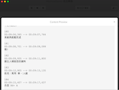
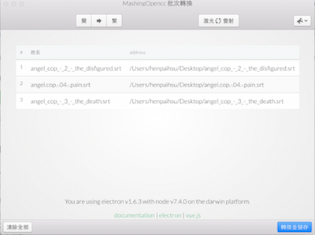

# subTrans

> An electron-vue project

**Screenshot**

 

**功能**

* 批次對文字檔簡繁轉換
* 支援預覽
* 現代外觀

**簡介**

由於一直沒有看到一個現代設計外觀又好用的簡繁字幕轉換，因此動手作一個。使用了[Vue.js](vuejs.org)以及[Bulma](bulma.io)與[Photon](http://photonkit.com/)作為界面設計，以[electron](electron.atom.io)作為跨平台的容器。其中使用[electron-vue](https://github.com/SimulatedGREG/electron-vue)以及[Vue-Blu](https://chenz24.github.io/vue-blu/)加快開發速度。

## 使用

1. 拖曳檔案至視窗中
2. 點擊該列可以預覽
3. 點擊`全部轉換`。__注意：考慮到使用流程順暢與失敗成本，轉換前不會警告覆蓋!__


## Build Setup

``` bash
# install dependencies
npm install

# serve with hot reload at localhost:9080
npm run dev

# build electron app for production
npm run build

# run webpack in production
npm run pack
```
More information can be found [here](https://simulatedgreg.gitbooks.io/electron-vue/content/docs/npm_scripts.html).

---

This project was generated from [electron-vue](https://github.com/SimulatedGREG/electron-vue) using [vue-cli](https://github.com/vuejs/vue-cli). Documentation about this project can be found [here](https://simulatedgreg.gitbooks.io/electron-vue/content/index.html).
